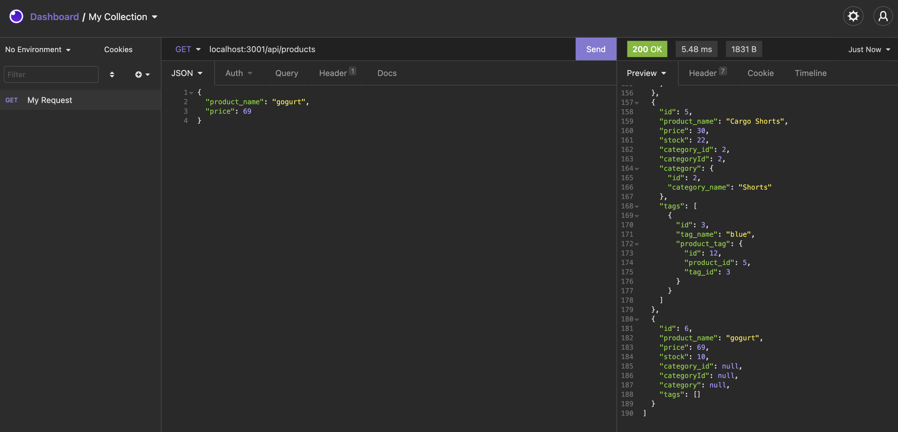
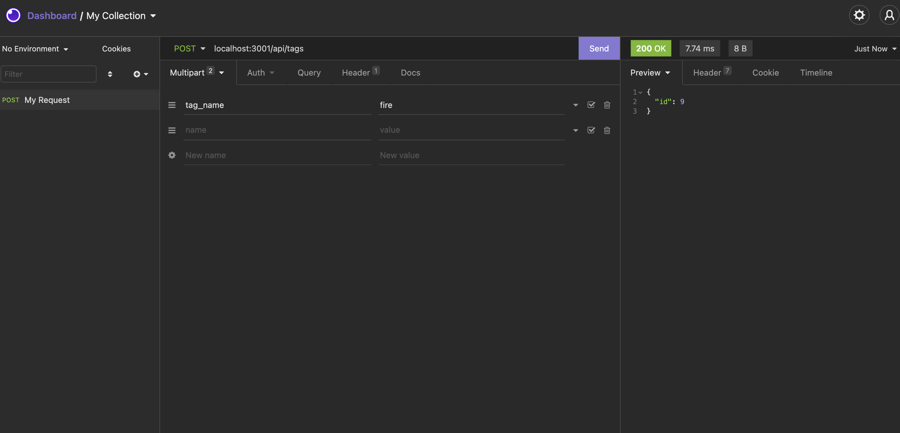
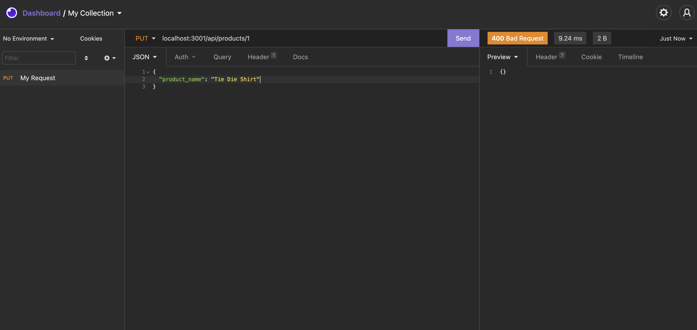
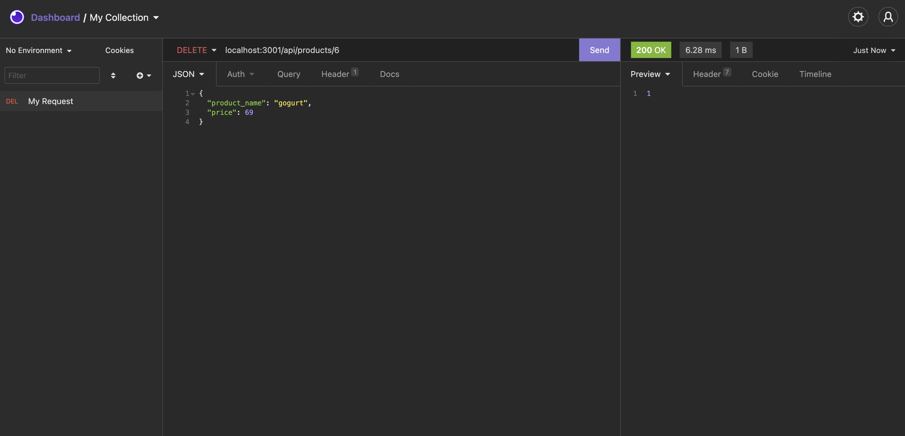

# E-Commerce Backend 
rsrs
## Description
This app was designed to help online retail stores manage products.

## Table of Contents
  - [Description](#description)
  - [Table of Contents](#table-of-contents)
  - [Installation](#installation)
  - [Usage](#usage)
  - [Contributing](#contributing)
  - [License](#license)
  - [Testing Instructions](#testing-instructions)
  - [Questions](#questions)

## Installation
You will need to install all npm packages listed in the 'dependencies' section of the package.json file to run this app. To do so, run `npm i` in a command line within the root level of the project folder.

## Usage
`GET` request  
  
`POST` request  
  
`PUT` request  
  
`DELETE` request  
  

## Contributing
You are welcome to contribute as you wish! Also, feedback is always welcome!

## License
This application is covered under the MIT License

## Testing Instructions

[Video](https://drive.google.com/file/d/1A__IWDodyCBmIotVMf2cHImv2mS3036A/view?usp=sharing)

## Questions
If you have any questions, please visit my Github profile or email me using the links below

[Deployed Site](https://dy-ecommerce.herokuapp.com/)  
[Repository](https://github.com/dimitermusic/ecommerce)

## Questions
If you have any questions, please visit my Github profile or email me using the links below

[Github](https://github.com/dimitermusic)  
[Email](mailto:dimitermusic@gmail.com)  

